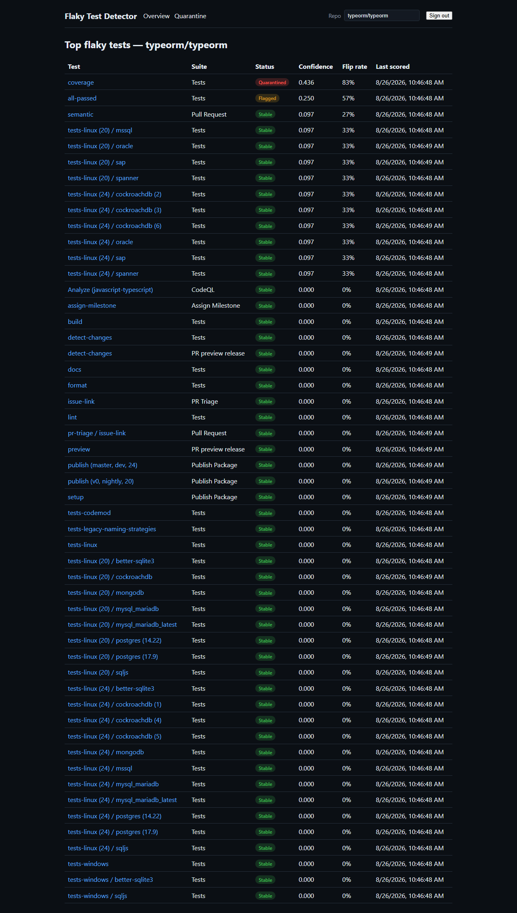
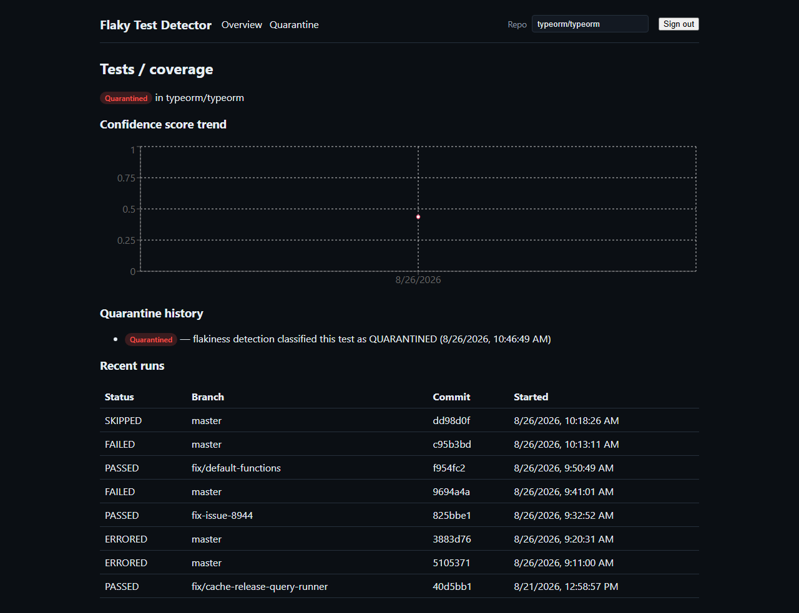
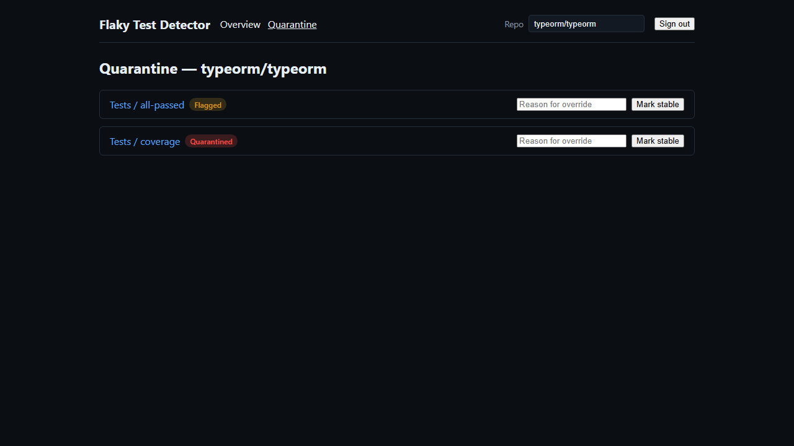

# Flaky Test Detector

Ingests historical GitHub Actions CI data, statistically identifies flaky tests (using
flip-rate + Wilson score confidence intervals, not a naive failure-rate threshold),
automatically quarantines them so they stop blocking merges, and surfaces findings on a
dashboard with Slack alerts.

Demo target repo: [typeorm/typeorm](https://github.com/typeorm/typeorm) — a large, active
project whose CI runs a wide matrix of real database containers (Postgres, MySQL, MSSQL,
MongoDB, CockroachDB, SQLite) per Node version and OS, which produces genuine flaky-CI
behavior from container startup races. It doesn't publish per-test JUnit XML, so ingestion
against it runs in job-level fallback mode; the per-test JUnit XML parser is implemented and
unit-tested against fixtures (see Sprint 1) even though this particular repo doesn't exercise
that path live.

## Before / after

**Before:** the only way to tell a genuinely broken job from a flaky one in a repo with
dozens of jobs across 30+ workflow files is to manually scroll each job's run history in the
GitHub UI, one job at a time, and eyeball whether its failures look intermittent.

**After**, one command (`npm run ingest -- --repo typeorm/typeorm --max-runs 60`) against the
real `typeorm/typeorm` repo produced:

- **45** workflow runs and **341** job-level results ingested, covering **52** distinct
  tracked tests/jobs, in under two minutes.
- Two tests correctly identified **without any staged data** — genuinely flaky by this
  project's own definition, not hand-picked: the `coverage` job (PASSED → FAILED → PASSED →
  FAILED → ERRORED → ERRORED → SKIPPED across its real recent runs, an 83% flip rate) was
  quarantined, and `all-passed` (57% flip rate) was flagged. See the confidence-score trend
  and full run history in [`docs/screenshots/test-detail.png`](docs/screenshots/test-detail.png).
- A concrete demonstration of why this project scores flip-rate with a confidence interval
  instead of a raw failure-rate threshold (ADR 0001): several jobs with only 2-3 runs each
  crossed the _raw_ quarantine threshold (confidence score 0.34-0.44) on pure percentage —
  e.g. `tests-linux (24) / spanner` failed 2 of 3 runs (~67%). A naive threshold would flag
  all of them immediately. This engine's Wilson-lower-bound score correctly held every one of
  them at `STABLE`, because that few runs (`FLAKINESS_MIN_RUNS`, default 6) is nowhere near
  enough evidence — exactly the false-positive class this project exists to avoid.
- All of it queryable via the REST API and visible in the dashboard immediately —
  see [`docs/screenshots/`](docs/screenshots/) below.

## Status

Feature-complete per the v1 spec: ingestion, detection, quarantine + Slack, REST API,
dashboard, and GitHub Action packaging are all implemented, tested, and verified end-to-end
against real `typeorm/typeorm` data (see "Before / after" above).

## Architecture

```
GitHub Actions API ──▶ Ingestion Adapter ──▶ Postgres (Prisma) ──▶ Detection Engine
                                                                         │
                                                                         ▼
                                                                 Quarantine State Machine
                                                                    │            │
                                                                    ▼            ▼
                                                              Slack Webhook   Dashboard API
                                                                                    │
                                                                                    ▼
                                                                          React Dashboard
```

- **Ingestion adapter** (`server/src/ingestion`) — pulls workflow run + job data via Octokit,
  behind an interface so other CI providers could be added later. GitHub Actions only in v1.
- **Test run store** — Postgres via Prisma. See `server/prisma/schema.prisma`.
- **Detection engine** (`server/src/detection`) — flip-rate + Wilson score confidence interval
  per test over a sliding window. See [`docs/adr/0001-wilson-score-confidence-intervals.md`](docs/adr/0001-wilson-score-confidence-intervals.md).
- **Quarantine system** (`server/src/quarantine`) — `stable → flagged → quarantined → stable`
  state machine with one Slack notification per transition.
- **Dashboard** (`dashboard/`) — React + Vite + Recharts.
- **GitHub Action** (`action/`) — the ingest/detect/quarantine pipeline packaged for reuse in
  any repo's own CI. See "Using this as a GitHub Action" below.

## Repo layout

Monorepo using npm workspaces (`server/`, `dashboard/`) rather than two separate repos: one
CI pipeline, shared root tooling, and atomic commits when an API change and its dashboard
consumer land together. Reversible later if needed — each workspace only talks to the other
over HTTP.

## Setup

Prerequisites: Node.js 22+, Docker.

```bash
cp .env.example .env
# fill in GITHUB_TOKEN, DASHBOARD_ACCESS_TOKEN (and optionally SLACK_WEBHOOK_URL) in .env
docker-compose up -d
# migrations run automatically on server startup; this populates the database once
# (the runtime image is lean and has no root package.json, so call the compiled CLI directly):
docker-compose run --rm server node server/dist/cli/ingest.js --repo typeorm/typeorm --max-runs 60
```

Then open the dashboard at http://localhost:5173 and sign in with your `DASHBOARD_ACCESS_TOKEN`.
The API is on http://localhost:3000.

For local development without Docker for the app itself:

```bash
npm install
docker-compose up -d postgres     # or point DATABASE_URL at a Postgres you already have
npm run prisma:generate --workspace server
npm run prisma:migrate --workspace server
npm run dev --workspace server    # API on http://localhost:3000
npm run dev --workspace dashboard
```

Note: docker-compose maps Postgres to host port **5433**, not 5432 — chosen to avoid
colliding with a Postgres instance you might already have running locally on the default
port. `.env.example`'s `DATABASE_URL` already points at 5433.

## Commands

| Command                                              | What it does                                                  |
| ---------------------------------------------------- | ------------------------------------------------------------- |
| `npm run lint`                                       | ESLint across the whole repo                                  |
| `npm run typecheck`                                  | TypeScript project checks for both workspaces                 |
| `npm test`                                           | Jest (server) + Vitest (dashboard)                            |
| `npm run test:coverage`                              | Same, with a coverage report                                  |
| `npm run build`                                      | Production builds for both workspaces                         |
| `npm run ingest -- --repo owner/name`                | Ingest CI history for a GitHub repo                           |
| `npm run ingest -- --repo owner/name --max-runs 300` | Same, capped to the N most recent workflow runs (default 300) |
| `npm run recompute -- --repo owner/name`             | Re-score flakiness + re-evaluate quarantine without ingesting |

## Ingestion

```bash
npm run ingest -- --repo typeorm/typeorm --max-runs 50
```

Pulls workflow runs newest-first via the GitHub Actions API, stopping once it reaches a run
already recorded in `IngestionCursor` (or `--max-runs`, whichever comes first) — safe to
re-run at any time; already-seen run/job combinations are upserted, never duplicated. For
each run's jobs, it looks for a JUnit XML artifact matching that job; if found, per-test
results are recorded, otherwise the job's own pass/fail is recorded as a single result
("job-level fallback mode"). Which mode is active is logged and persisted on the cursor.

`typeorm/typeorm` runs in job-level fallback mode — it doesn't publish JUnit XML — so its
`Test` rows are workflow job names (e.g. `mysql-node-20-linux`), not individual test cases.

## Detection

```bash
npm run recompute -- --repo typeorm/typeorm
```

For each test in the repo, scores its most recent runs (sliding window, default 50 runs /
30 days — see `FLAKINESS_*` env vars) using flip rate + a Wilson score confidence interval,
not a raw failure-rate threshold — see
[`docs/adr/0001-wilson-score-confidence-intervals.md`](docs/adr/0001-wilson-score-confidence-intervals.md)
for why. Each test is classified `STABLE` / `FLAGGED` / `QUARANTINED` and a new
`FlakinessScore` row is appended (history is kept, not overwritten, so the dashboard can chart
a trend in Sprint 4). This also runs automatically at the end of `npm run ingest`.

## Quarantine

Right after every recompute (so, automatically at the end of `npm run ingest` and
`npm run recompute`), each test's quarantine status is re-evaluated against a
`stable → flagged → quarantined → stable` state machine (`server/src/quarantine`):

- While **not** quarantined, status simply tracks the detection engine's latest
  classification; a `QuarantineEvent` is recorded only when the status actually changes (this
  is what makes re-running ingestion safe — no repeat Slack spam on every run).
- Once **quarantined**, the flip-rate score is ignored for demotion — only
  `QUARANTINE_CLEAN_RUNS_REQUIRED` (default 10) consecutive passed runs since quarantine began
  will auto-promote it back to `STABLE`. See
  [`docs/adr/0003-quarantine-auto-promotion.md`](docs/adr/0003-quarantine-auto-promotion.md)
  for why demotion uses a different signal than promotion.
- A Slack notification fires exactly once, only on the transition **into** `QUARANTINED`
  (set `SLACK_WEBHOOK_URL` to enable; without it, this step logs a warning and no-ops).

### REST API

All routes require `Authorization: Bearer <DASHBOARD_ACCESS_TOKEN>`.

| Method & path                    | What it does                                                                               |
| -------------------------------- | ------------------------------------------------------------------------------------------ |
| `GET /api/tests?repo=owner/name` | List tests for a repo with their latest score + quarantine status                          |
| `GET /api/tests/:id`             | Full history for one test: runs, score history, quarantine events                          |
| `POST /api/tests/:id/quarantine` | Manual override — body `{ "status": "STABLE"\|"FLAGGED"\|"QUARANTINED", "reason": "..." }` |

## Dashboard

```bash
npm run dev --workspace dashboard   # http://localhost:5173, talking to the API on :3000
```

React + Vite + Recharts, gated by a simple token screen (enter your `DASHBOARD_ACCESS_TOKEN`;
it's stored in `localStorage` and attached as a bearer token on every API request — no
separate user/auth system per the v1 scope). Set `VITE_API_BASE_URL` if the API isn't on
`http://localhost:3000` (see `dashboard/.env.example`).

**Overview** — every test for the selected repo, ranked by confidence score:



**Test detail** — confidence-score trend, quarantine history, and recent runs for one test:



**Quarantine** — currently flagged/quarantined tests, with a manual override control:



## Using this as a GitHub Action

The ingest → recompute → quarantine pipeline is also packaged as a standalone Docker-based
GitHub Action (`action/`), reusable in **any** repo's own CI, not just this one:

```yaml
- uses: aline-eng/Flaky-Test-Detector/action@main
  with:
    database-url: ${{ secrets.FLAKY_DB_URL }} # any reachable Postgres
    max-runs: '100'
    slack-webhook-url: ${{ secrets.SLACK_WEBHOOK_URL }} # optional
```

`repo` and `github-token` default to the calling repo and `${{ github.token }}`, so most
callers only need to provide `database-url`. The action writes a job summary listing
quarantined tests and exposes `quarantined-count` / `flagged-count` outputs.

The action references a pre-built image (`ghcr.io/aline-eng/flaky-test-detector-action`)
rather than building on every run, because a Docker action's automatic build uses the
action's own directory as build context, which can't reach the rest of this monorepo. The
image is built and published by
[`.github/workflows/publish-action-image.yml`](.github/workflows/publish-action-image.yml) on
every push to `main` that touches `action/` or `server/` — so the tag only exists after this
repo's own CI has run at least once on GitHub.

## Test coverage

```bash
npm run test:coverage
```

Current coverage (`server`: Jest, `dashboard`: Vitest, both v8 coverage):

| Workspace   | Statements | What's covered / not                                                                                                                                                                                                                                                                                                                                                                                                                                                                 |
| ----------- | ---------- | ------------------------------------------------------------------------------------------------------------------------------------------------------------------------------------------------------------------------------------------------------------------------------------------------------------------------------------------------------------------------------------------------------------------------------------------------------------------------------------ |
| `server`    | ~60%       | Pure logic and orchestration (Wilson score, flip-rate, quarantine state machine, ingestion adapter) are covered directly and heavily (84-100% each). Thin Prisma passthrough wrappers (`prismaRecomputeStore`, `prismaQuarantineStore`, `testsRepository`) and CLI entrypoints are exercised via the real end-to-end runs documented above and in-browser (see Dashboard), not unit tests — see the individual module `%` in a fresh `npm run test:coverage --workspace server` run. |
| `dashboard` | ~89%       | All three pages and every shared component.                                                                                                                                                                                                                                                                                                                                                                                                                                          |

## Testing framework choice

Server: Jest + Supertest (per spec). Dashboard: Vitest + React Testing Library rather than
Jest — the dashboard is a Vite project, and Vitest shares Vite's config/transform pipeline
(ESM, CSS, JSX) without the extra config Jest needs to work inside a Vite app.

## Documentation

- [ADR 0001: Wilson score confidence intervals instead of a raw failure-rate threshold](docs/adr/0001-wilson-score-confidence-intervals.md)
- [ADR 0002: GitHub Actions only for v1, behind a CI provider adapter interface](docs/adr/0002-github-actions-only-with-adapter-interface.md)
- [ADR 0003: Auto-promotion out of quarantine after N consecutive clean runs](docs/adr/0003-quarantine-auto-promotion.md)
